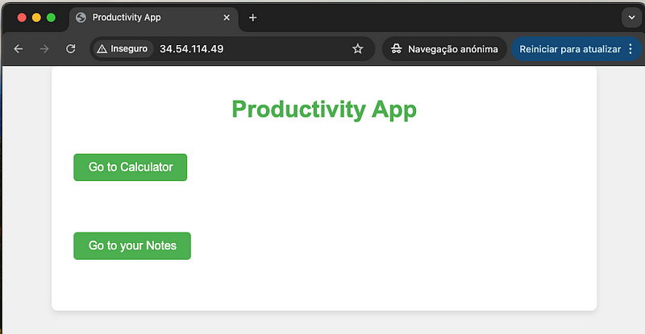

# cn-project-app
Simple Productivity Web App repo deployed on Cloud Run using CI/CD, Infrastructure as Code (Terraform) and Docker.

You can check the project's articles here:
- [Part 1](https://medium.com/@goncalo.h.almeida/deploying-a-cloud-native-serverless-app-with-terraform-and-ci-cd-on-cloud-run-part-1-fee892cc49b9): introduction and foundation
- [Part 2](https://medium.com/@goncalo.h.almeida/deploying-a-cloud-native-serverless-app-with-terraform-and-ci-cd-on-cloud-run-part-2-68f1f0538151): Infrastructure CI/CD
- Part 3 (coming soon): Application CI/CD
